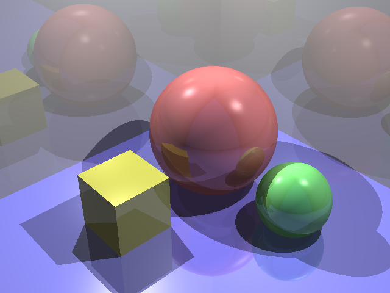
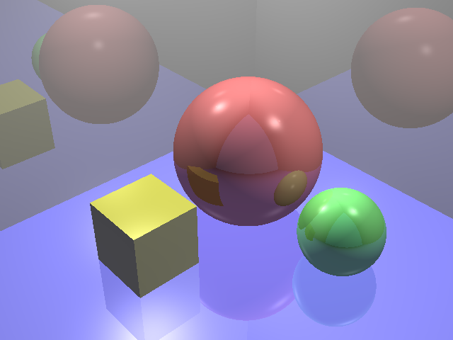
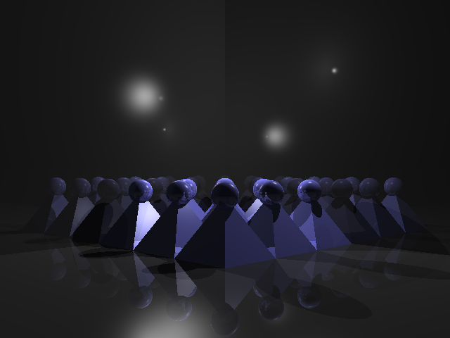
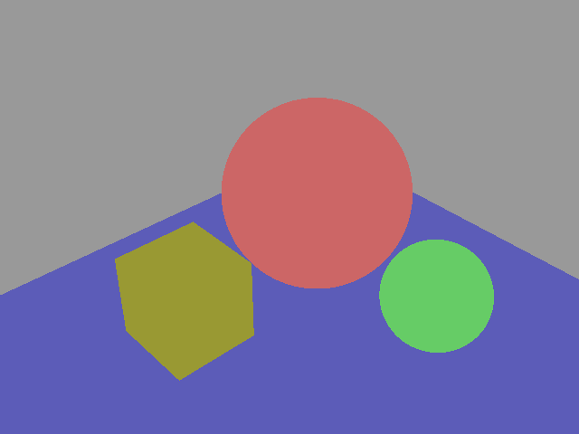

# renderer
> An implementation of whitted ray tracing, part of the introductory Computer Graphics course at NUS.

### Some results

 
*2 levels of reflection; Shadows enabled*
 

 
*1 level of reflection; Shadows disabled*
 

 
*2 levels of reflection; Shadows enabled*
 

 
*0 levels of reflection; Shadows disabled*